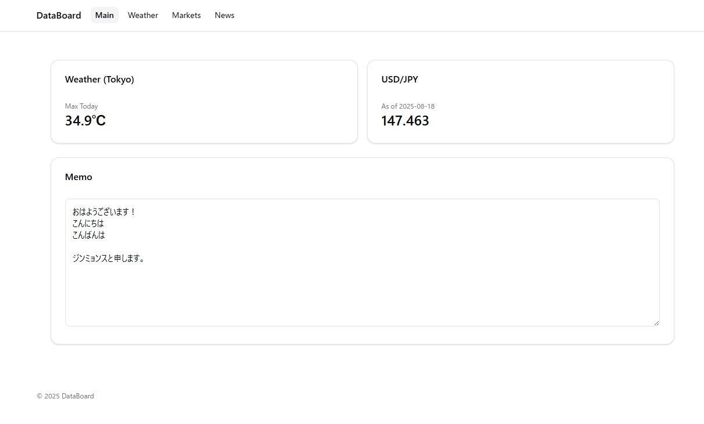
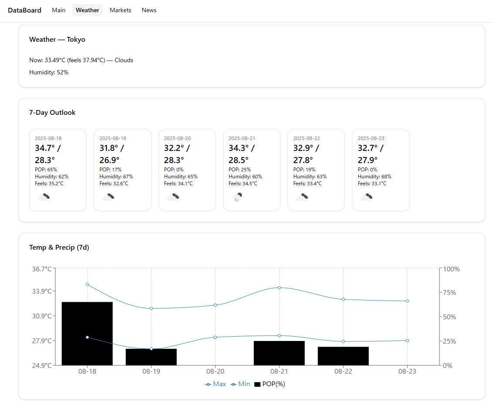
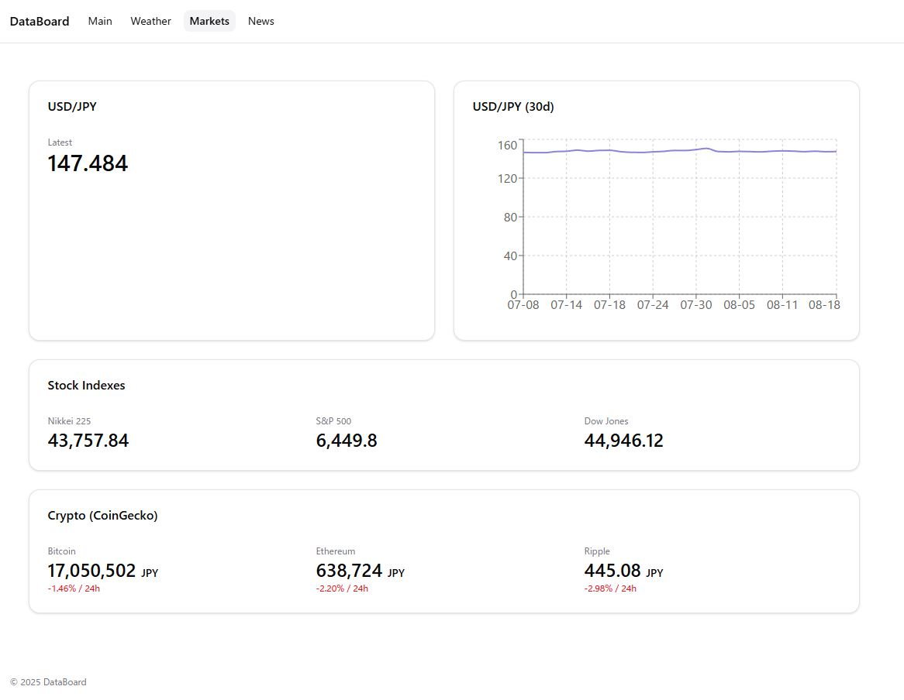
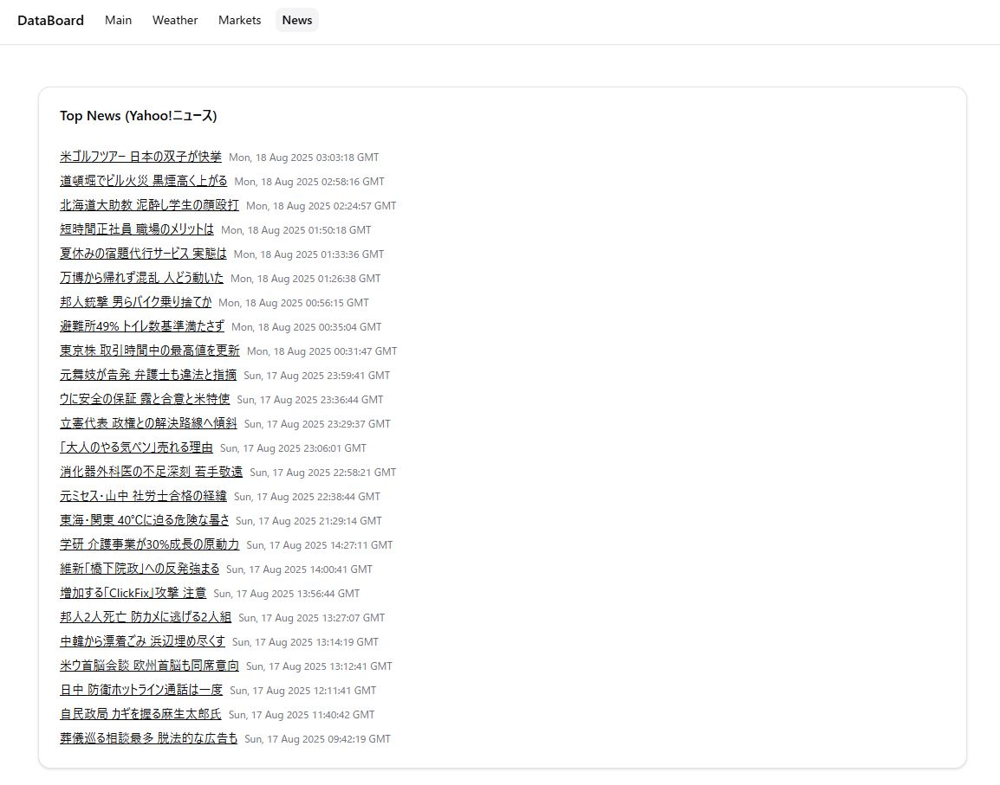

# DataBoard

天気 / マーケット / ニュース をまとめた Next.js 製のダッシュボード。

<p align="left">
  
  
  
  
</p>

## 🔗 目次
- [機能](#-機能)
- [技術スタック](#-技術スタック)
- [プロジェクト構成](#-プロジェクト構成)
- [始め方](#-始め方)
- [環境変数](#-環境変数)
- [スクリプト](#-スクリプト)
- [デプロイ](#-デプロイ)
- [ロードマップ](#-ロードマップ)
- [ライセンス](#-ライセンス)

## ✨ 機能
- **Main**: サマリーカード
- **Weather**: 現在の天気 + 7日間予報 (OpenWeatherMap)
- **Markets**: 株価指数 / 暗号通貨サマリー
- **News**: ニュースフィード

## 🧰 技術スタック
- **Next.js (App Router)**, **TypeScript**
- **Tailwind CSS**, **shadcn/ui**
- **Recharts** (チャート), **pnpm**

## 📸 スクリーンショット

### Main


### Weather


### Markets


### News


## 🗂 プロジェクト構成
data-board/
├─ public/ # 静的ファイル
├─ src/app/ # ルート(/, /weather, /markets, /news)
│ ├─ layout.tsx
│ ├─ page.tsx # Main
│ ├─ weather/
│ ├─ markets/
│ └─ news/
├─ .env.local # (ローカル専用) 環境変数
├─ next.config.ts
└─ package.json


## 🚀 始め方
```bash
# 1) クローン
git clone https://github.com/Tama-Jin/data-board.git
cd data-board

# 2) 依存関係をインストール
pnpm install

# 3) 環境変数を設定 (.env.local)
# 下記 [環境変数] を参照

# 4) ローカル実行
pnpm dev
# http://localhost:3000

pnpm dev        # 開発サーバー起動
pnpm build      # 本番ビルド
pnpm start      # ビルド実行
pnpm lint       # Lint

## 🔐 環境変数
`.env.local` を作成し、以下の値を設定してください（値は各自で取得）


👉 OpenWeatherMap (https://openweathermap.org/api) で無料アカウントを作成し、API Key を取得してください。


☁️ デプロイ

Vercel: GitHub と連携してプロジェクトをインポート

Settings → Environment Variables に OWM_API_KEY を登録

main ブランチに push すると自動デプロイ

🗺 ロードマップ

 Weather: 都市検索/選択機能

 Markets: ローディング最適化 & キャッシュ

 News: キーワードフィルタ / ダークモード

 e2e テスト (Playwright)